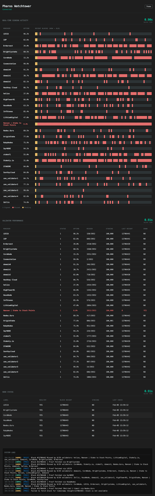

# Pharos Watchtower

Pharos Watchtower is a real-time monitoring service for validator participation and node health. It ingests new blocks, fetches proof data, tracks validator uptime/misses, and exposes a dashboard and Prometheus metrics.



## What we monitor

### Validators
- **Validator list**
  - `chain.mode: all` → monitors all validators from the on-chain registry
  - `chain.mode: selected` → monitors only the `chain.validators` list (BLS public keys)
- **Uptime measurement**
  - For each block, the watcher fetches the block proof and checks `SignedBlsKeys`
  - A rolling window (configured by `advanced.window`) tracks signed vs missed
  - Uptime = `1 - (missed / total)` over the window

### Nodes
- **Health**
  - RPC connectivity checks are performed periodically
- **Block height**
  - Updated via WebSocket `newHeads` events
- **Syncing** (current)
  - Based on RPC `SyncProgress` (non-nil → syncing)

## Roadmap / TODO
- Replace/augment RPC-derived metrics with **WS/GRPC-based** sources where possible
- Improve **node syncing** detection beyond the current RPC `SyncProgress` check

## Binary

### Requirements
- Go 1.24+

### Build
```sh
make build
```

This will:
- Build the binary into `$(go env GOPATH)/bin/pharos-watchtower`
- Create `~/.pwt/data`
- Create `~/.pwt/config.yml` from `config.example.yml` if missing

### Run
```sh
pharos-watchtower start
```

Custom paths:
```sh
pharos-watchtower start -config /path/to/config.yml -data-dir /path/to/data
```

Defaults:
- config: `~/.pwt/config.yml`
- data-dir: `~/.pwt/data`

## Docker

### Requirements
- Docker + Docker Compose

### Run
```sh
git clone https://github.com/leccaventures/pharos-watchtower.git
cd pharos-watchtower
cp config.example.yml config.yml

docker compose up -d --build
```

The compose file mounts:
- `./config.yml` → `/root/.pwt/config.yml` (read-only)
- `./data` → `/root/.pwt/data`
